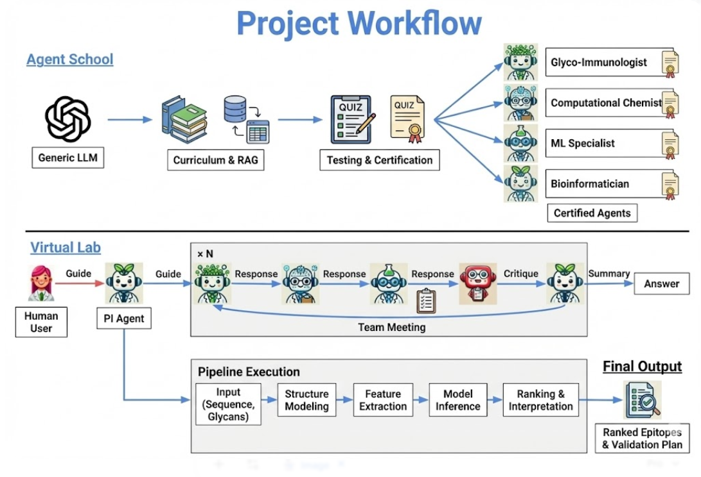

# GlycoConjVacEpitopeMapper
**Computational Strategy for Epitope Mapping of Glycoconjugate Vaccines Using Deep Learning & Virtual Lab Agents**

---

## 1. Overview
This repository implements a **multi-agent research framework** for identifying protective conformational epitopes on glycoconjugate vaccines. It bridges high-fidelity structural biology with deep learning through a tiered "Virtual Lab" architecture.

It combines:
- **Agent Schools**: Structured training of specialized agents (Immuno, Chem, ML, Bioinfo) using RAG.
- **Virtual Lab**: Multi-agent orchestration for pipeline design and automated scientific execution.



---

## 2. Research Workflow (The "Swanson" Architecture)

The project follows a two-phase conceptual cycle inspired by the Virtual Lab architecture (Swanson et al. 2024):

### 2.1 Agent School Phase
Before entering the lab, agents undergo structured mastery:
1. **Curriculum Design**: Define mastery levels for each domain (Glyco, Chem, ML, Bio).
2. **Autonomous Study**: Agents retrieve and process literature (PubMed/FAISS) to build localized RAG indexes.
3. **Integration**: Knowledge is synthesized into "Knowledge Updates" and stored in vector indices.
4. **Certification**: Agents are assessed by a "Scientific Critic" to ensure conceptual and practical competence.

### 2.2 Virtual Lab Phase
Certified agents collaborate in a simulated research environment:
1. **Planning**: Defining vaccine constructs (e.g., MenA + CRM197) and auditing structural feasibility.
2. **Pipeline Design**: Selecting toolsets (AlphaFold, Rosetta, GNN) for tiered verification.
3. **Implementation**: Coding the structural modeling, simulation, and feature pipelines.
4. **Validation**: Ranking candidate epitopes and cross-referencing with IEDB experimental data.

---

## 3. Methodology & Tiers
The implementation translates the workflow into a multi-tiered validation approach:
- **Tier 1 (Biological Screening)**: Solvent exposure (SASA) and T-cell epitope (PPZ) masking.
- **Tier 2 (Physical Simulation)**: MD-based RMSF analysis to quantify "Phosphate Cloud" shielding.
- **Tier 3 (ML Modeling)**: SE(3)-Transformer/GNN using ESM-2 sequence embeddings and structural tensors.

---

## 4. Repository Structure
- `src/virtual_lab`: Core `Agent` logic and multi-turn meeting orchestration.
- `src/agent_schools`: Curricula, retrievers, and school orchestration scripts.
- `src/virtual_lab/bioinformatics`: Screening tools (Bio.PDB).
- `src/virtual_lab/chemistry`: Simulation engines and chemical protocols (Rosetta/Amber).
- `src/virtual_lab/epitope_mapping`: ESM-2 feature extraction and GNN training loops.
- `dashboard/`: React-based visual analysis command center.
- `data/knowledge_base`: FAISS vector stores for specialist agents.

---

## 5. Installation

1.  **Set up Conda Environment**:
    ```bash
    conda env create -f environment.yml
    conda activate epitope_mapping
    ```

2.  **Install Dependencies**:
    ```bash
    pip install -e .
    ```

3.  **Agent Schools Orchestration**:
    Run a full academic cycle to train and certify your agents:
    ```bash
    python src/agent_schools/run_school.py
    ```

4.  **Knowledge Indexing**:
    Manually build/refresh the vector stores if new research is added:
    ```bash
    python run_indexing.py
    ```

5.  **Configuration**:
    Update `src/virtual_lab/constants.py` with your **Gemini API Key**.

---

## 6. Pipeline Execution Guide

Run the following commands in order for a full end-to-end simulation:

### A. Initialization
Download the target structure (CRM197) and finalize planning:
```bash
python get_pdb_4ae1.py
python src/virtual_lab/main_epitope_mapping.py
```

### B. Tier 1: Screening
Perform biological masking and SASA calculations:
```bash
python src/virtual_lab/bioinformatics/crm197_screening.py
```

### C. Tier 2 & 3: Simulation & Training
Generate high-fidelity fluctuational data and train the GNN predictor:
```bash
python src/virtual_lab/chemistry/run_amber_simulation.py
python src/virtual_lab/epitope_mapping/extract_md_features.py
python src/virtual_lab/epitope_mapping/train_esm2_gnn.py
```

### D. Analysis & Dashboard
Visualize all findings in the interactive dashboard:
```bash
python src/virtual_lab/analysis/export_dashboard_data.py
cd dashboard
npm install
npm run dev
```

---

## 7. Success Metrics
- **IEDB Recovery**: Alignment with documented protective epitopes.
- **T-cell Preservation**: Zero-overlap with protected presentation zones.
- **Phosphate Shielding**: Correlation between glycan flexibility and model accessibility indices.

---

## 8. License
MIT License